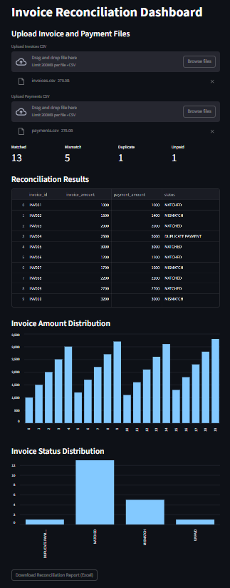

# Automated Invoice Reconciliation System


A **Python based financial reconciliation tool** that automatically matches invoices with payments and detects discrepancies such as mismatched amounts, duplicate payments, and unpaid invoices.

The system includes an **interactive Streamlit dashboard** that allows users to upload CSV files, analyze reconciliation results, visualize financial metrics, and download reports.

---

# Dashboard Preview

<p align="center">
  
</p>

---

# Features

- Upload **Invoice CSV** and **Payment CSV** directly from the dashboard
- Automatically detect:
  - ✅ Matched invoices
  - ❌ Mismatched payments
  - 🔁 Duplicate payments
  - ⏳ Unpaid invoices
- Display **KPI metrics** for reconciliation results
- Interactive charts for:
  - Invoice amount distribution
  - Invoice status distribution
- Generate reconciliation results dynamically
- Download reconciliation report as **Excel file**
- Error handling for missing or invalid files
- Clean project structure following real-world development practices

---

# Tech Stack

- **Python**
- **Pandas** – data processing
- **Streamlit** – interactive dashboard
- **Git & GitHub** – version control
- **CSV / Excel** – financial data input/output

---

# System Architecture

      CSV Files
  (Invoices & Payments)
           │
           ▼
    Reconciliation Engine
        (Python + Pandas)
           │
           ▼
 Financial Matching Logic
- Detect mismatches
- Detect duplicates
- Detect unpaid invoices
           │
           ▼
    Processed DataFrame
           │
           ▼
    Streamlit Dashboard
 - KPI Metrics
 - Data Tables
 - Charts
           │
           ▼
    Excel Report Download

---

# Project Structure

```bash
invoice-reconciliation-system
│
├── dashboard.png
├── README.md
├── requirements.txt
│
├── data
│ ├── invoices.csv
│ └── payments.csv
│
├── src
│ ├── reconcile.py
│ └── dashboard.py
│
└── results
└── reconciliation_results.csv
```

---

# How It Works

1. User uploads **Invoice CSV** and **Payment CSV** in the dashboard.
2. The reconciliation engine processes the data.
3. The system matches invoices with payments using invoice IDs.
4. Results are categorized into:

- MATCHED  
- MISMATCH  
- DUPLICATE PAYMENT  
- UNPAID  

5. Results are displayed through:

- KPI metrics
- Data tables
- Interactive charts

6. The reconciliation report can be downloaded as an **Excel file**.

---

# Example CSV Format

## invoices.csv

```bash
invoice_id,amount
INV001,1000
INV002,1500
INV003,2000
```

## payments.csv

```bash
reference,amount
INV001,1000
INV002,1400
INV003,2000
```

---

# Installation

Clone the repository:

```bash
git clone https://github.com/YOUR_USERNAME/invoice-reconciliation-system.git

Navigate to the project directory:

cd invoice-reconciliation-system

Install dependencies:

pip install -r requirements.txt
Run the Application

Start the Streamlit dashboard:

python -m streamlit run src/dashboard.py

Then open in your browser:

http://localhost:8501
Sample Workflow

Upload invoices.csv

Upload payments.csv

View reconciliation results

Analyze charts and metrics

Download the Excel reconciliation report
```

## Quick Start

```bash
git clone https://github.com/Mounesht0/invoice-reconciliation-system.git
cd invoice-reconciliation-system
pip install -r requirements.txt
python -m streamlit run src/dashboard.py
```
---

## Key Learning Outcomes

This project demonstrates:

- Financial data processing with Pandas

- Building interactive dashboards with Streamlit

- Handling real-world data issues (duplicates, mismatches, missing data)

- Writing defensive code and error handling

- Structuring a project for production-style development

- Using Git and GitHub for version control


Future Improvements:

- Database integration (PostgreSQL / MySQL)

- API-based invoice ingestion

- Authentication system

- Automated reconciliation scheduling

- Deployment to cloud (Streamlit Cloud / AWS)

---

Author

Mounesh

GitHub: https://github.com/Mounesht0
